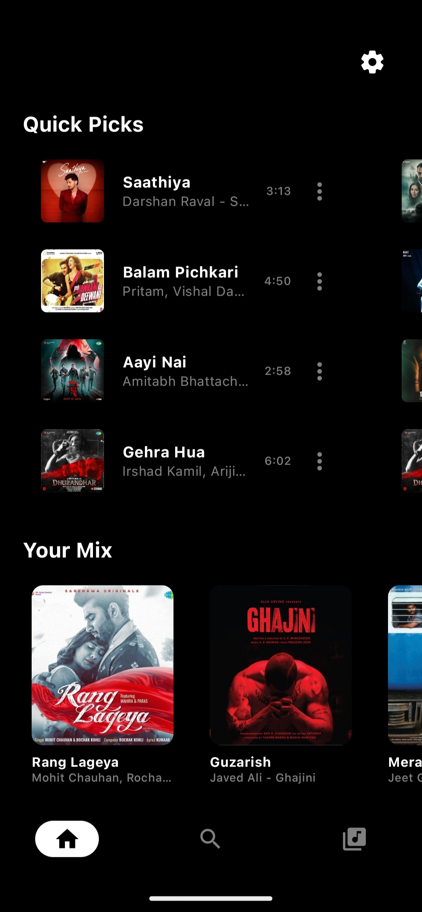
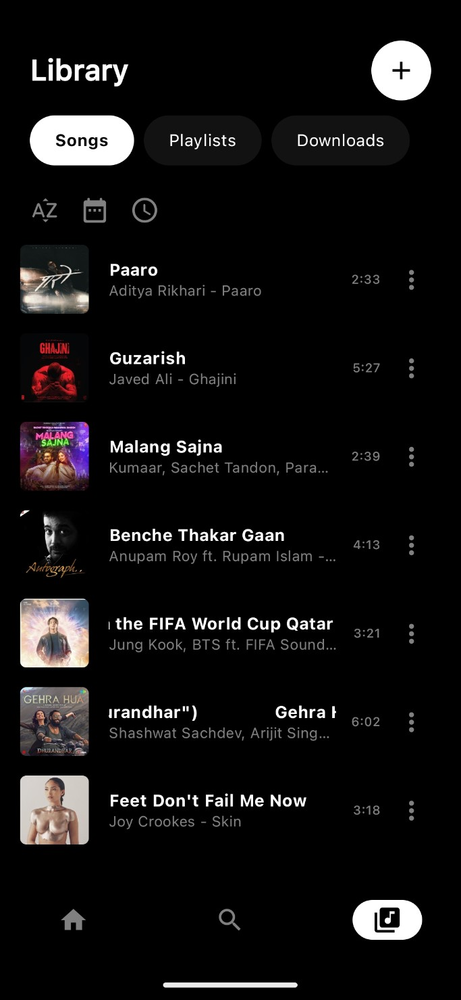
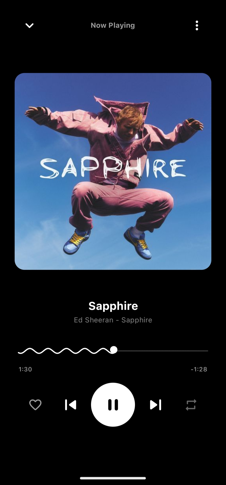

# AlphaMusic

AlphaMusic is a modern, streaming music application for Android, built with the latest technologies to deliver a seamless, smooth, and immersive listening experience.

---

## Features

AlphaMusic offers a comprehensive suite of features designed for music lovers:

### Music Playback
*   **High-Quality Audio:** Stream music at the highest available bitrate.
*   **Curated Content:** Discover trending tracks, curated playlists, and new releases directly from the home screen.
*   **Real-Time Search:** Find your favorite songs instantly with a debounced, real-time search interface.
*   **Sleep Timer:** Set a timer to automatically pause playback, perfect for listening before bed.
*   **Offline Playback:** Download songs for offline listening, with live progress tracking and management.

### Library Management
*   **Personalized Library:** "Like" your favorite songs to save them to your library.
*   **Custom Playlists:** Create and manage your own playlists.
*   **Downloads Hub:** Access all your downloaded, offline music in one dedicated location.
*   **Flexible Sorting:** Organize your library by name, date added, or song duration.

### Design and Theming
*   **Material 3:** Built on Google's latest design system for a clean, modern look.
*   **Immersive Dark Mode:** An always-on dark theme that is easy on the eyes.
*   **Dynamic Theming:** The player screen dynamically extracts the dominant color from album art to create a personalized, themed background.

### Performance
*   **Optimized for Smoothness:** All lists use stable keys for jank-free scrolling, and expensive operations are memoized to prevent unnecessary UI updates.
*   **Efficient State Management:** Uses `StateFlow` with a `WhileSubscribed` strategy to ensure data is only observed when the UI is visible, saving battery and resources.
*   **Minimized Network Overhead:** API calls are optimized, and logging is configured to be lightweight, ensuring a fast and responsive experience.

---

## Screenshots

| Home | Search |
| :---: | :---: |
|  |  |

| Library | Player |
| :---: | :---: |
|  |  |

---

## Download

The latest release is available on the [Releases page](https://github.com/arghamuhury/AlphaMusic/releases/latest).

### Building from Source

To build the app from source, you will need Android Studio and the Android SDK.

1.  **Clone the repository:**
    ```bash
    git clone https://github.com/arghamuhury/AlphaMusic.git
    ```
2.  **Navigate to the project directory:**
    ```bash
    cd AlphaMusic
    ```
3.  **Build the debug APK:**
    ```bash
    ./gradlew assembleDebug
    ```
    The generated APK will be located at `app/build/outputs/apk/debug/app-debug.apk`.

**Note:** This application relies on third-party APIs (JioSaavn) for music streaming. The availability and functionality of these services are not guaranteed.

---

## Tech Stack

| Layer | Technology |
|---|---|
| **UI** | Jetpack Compose, Material 3 |
| **Architecture** | MVVM with Hilt for Dependency Injection |
| **Database** | Room (SQLite) |
| **Media Playback** | ExoPlayer (Media3) |
| **Networking** | Retrofit & OkHttp |
| **Image Loading** | Coil |
| **Theming** | Dynamic dark theme |

---

## Author

**Argha Muhury**

*   GitHub: [@arghamuhury](https://github.com/arghamuhury)

---

## License

```
Copyright (C) 2026 Argha Muhury

Licensed under the Apache License, Version 2.0 (the "License");
you may not use this file except in compliance with the License.
You may obtain a copy of the License at

    http://www.apache.org/licenses/LICENSE-2.0

Unless required by applicable law or agreed to in writing, software
distributed under the License is distributed on an "AS IS" BASIS,
WITHOUT WARRANTIES OR CONDITIONS OF ANY KIND, either express or implied.
See the License for the specific language governing permissions and
limitations under the License.
```
